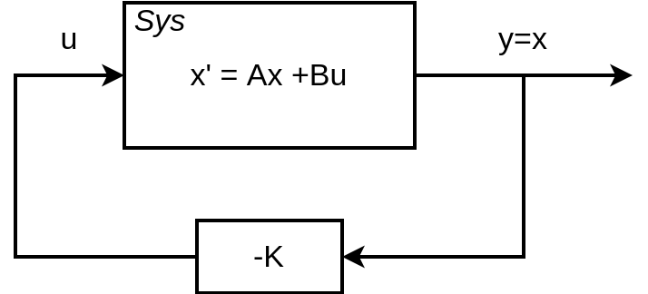

# 课程目标：

通过状态矩阵$\mathbf{A}$和输入矩阵$\mathbf{B}$判断，这个系统$\dot{x}=\mathbf{A}x+\mathbf{B}u$是否是可控制的。

在实际场景中，$\mathbf{A}$是由受控系统（plant）本身的物理特性决定。$\mathbf{B}$可能是可调整的。但是有些场景下$\mathbf{B}$也是给定的，收到传感器和执行器的硬件设计约束。

如果输入矩阵$\mathbf{B}$选取正确，则对于一个线性系统来说，它总是可控的。

举例来说：
* 一个直观的不可控系统 （Sys1）
$$\dot{x} = \begin{bmatrix} 1 & 0\\ 0 & 1 \end{bmatrix}x+
\begin{bmatrix} 0 \\ 1 \end{bmatrix}u$$
因为没有输入值$u$可以被反馈到$x_1$去，即$\mathbf{B}_{1, 1} =0$。

* 一个直观的稳定系统
$$\dot{x} = \begin{bmatrix} 1 & 0\\ 0 & 1\end{bmatrix}x+
\begin{bmatrix} 1 & 0\\0 & 1 \end{bmatrix}u$$

直观上来说，这个系统这个可以对$\dot{x_1}和\dot{x_2}$分别进行控制。

* 一个不直观的稳定系统 （Sys2）
$$\dot{x} = \begin{bmatrix} 1 & 1\\ 0 & 1 \end{bmatrix}x+
\begin{bmatrix} 0 \\ 1 \end{bmatrix}u$$

在这个例子里面，因为$x_1$和$x_2$是耦合的，所以通过$u$控制$x_2$也可，变相的控制了$x_1$。通过搜索，这个例子可以找出一个合理的$u$使系统稳定。

以上的方法是一种直观的判断，但对于一些复杂的系统，没有办法直观的判断这个输入$u$是否是可控的。

判断系统是否可控是有一个判据的，如下，
$$\mathcal{C} = [\mathbf{B} ~ \mathbf{AB} ~ \mathbf{A^2B} ~ \cdots \mathbf{A^nB}]$$
查看$\mathcal{C}$是否有$n$个独立的列（满秩的列），即$rank(\mathcal{C}) = n$，则系统使可控的，否则，系统不可控。 

*** 这里可以直观的理解为（但不准确），$\mathcal{C}$可以看成$\mathbf{B}$通过$\mathbf{A}$演化$n$次的响应。

# 通过可控性判据的例子

对于系统Sys1来说
$$\mathcal{C} = \begin{bmatrix} 0 & 0 \\ 1 & 2 \end{bmatrix}$$
$rank(\mathcal{C}) = 1 < 2$，即不可控。

对于系统Sys1来说
$$\mathcal{C} = \begin{bmatrix} 0 & 1 \\ 1 & 2 \end{bmatrix}$$
$rank(\mathcal{C}) = 2$，即可控。

