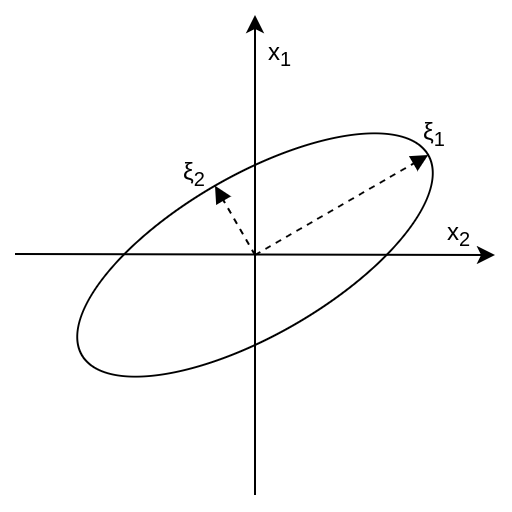

# 课程目标：
可以更加精细的判断一个系统的可控性。通过Gramians可以计算不同状态量的可控性区别。
做法即对可控性判据矩阵进行特征值分解$SVD(\mathcal{C})$，或者有时也被称为系统的Gramians来实现。

# 系统的解析解
一个受控系统（plant）的解析解是：
$$x(t) = e^{\mathbf{A}t}x(0)$$
一个控制系统的解析解：
$$x(t) = e^{\mathbf{A}t}x(0) + \int^t_0{e^{\mathbf{A}(t - \tau)}\mathbf{B}u(\tau)}d \tau$$

这个式子的第二部分可以看成$e^{\mathbf{A}t}$和$u(t)$的卷积，其中把$e^{\mathbf{A}t}$是卷积核，被应用在$u(t)$上。

# 系统的可控Gramian

可控Gramian定义为：
$$W_t = \int^t_0{e^{\mathbf{A}\tau}\mathbf{B}\mathbf{B}^*e^{\mathbf{A*}\tau}}d\tau \in \mathbb{R}^{n \times n}$$

在这个例子里面，$W_t$是实数域对称矩阵。它的特征值总是非负的。
通过特征值分解：
$$W_t \xi = \lambda \xi$$
对特征值进行排序，对应最大特征值的特征向量在**状态空间**的可控性最高。物理意义是可以通过最小的能量，让系统产生最大的响应。

对于一个离散时间系统，$W_t \approx \mathcal{C}\mathcal{C}^*$

可以看出$W_t$是$\mathcal{C}$的奇异值：

$$[\text{U}, \Sigma, \text{V}] = svd(\mathcal{C}, \text{'ecom'})$$

这里，$W_t$特征值$\lambda$是奇异值$\Sigma$的平方。特征向量$\xi$是奇异矩阵$\text{U}$的列。因此，奇异矩阵$\text{U}$的第一列是最好控制的，以此类推，直到最不好控制的量。
##图示

比如说下图中$\xi_1$是最容易控制的特征量（例如需要很少的能量），而$\xi_2$是最男控制的量（例如需要更多的能量）。

在给定控制能力（能量）的情况下，可以在这个椭圆边沿边移动，不同的位置指的是对不同变量能够控制到什么程度。
比如说，一个人可以很好的开车前进和后退，做侧向停车却很难。通过奇异值分解，可以找到不同因素对控制难度的不同影响。
**[我的疑惑：不知道这个椭圆上的具体的物理意义，控制能够达到这个点（这么多）是啥物理意思？]**