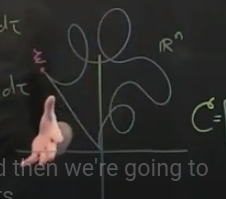

# Cayley-Hamilton Theorem

In linear algebra, the Cayley–Hamilton theorem (named after the mathematicians Arthur Cayley and William Rowan Hamilton) states that every square matrix over a commutative ring (such as the real or complex field) satisfies its own characteristic (eigenvalue) equation.

For (almost) any matrix A, it satisify $|\mathbf{A} - \lambda \mathbf{I}| = 0$. For example a $3\times3$ matrix, the solution to $|\mathbf{A} - \lambda \mathbf{I}| = 0$ is

$$\lambda^3 + (tr(\mathbf{A})\lambda^2)+dm(\mathbf{A})\lambda + |\mathbf{A}| = 0$$

Here, $tr$ means the trace and $dm$ means the minors of the terms at the leading diagnal of $\mathbf{A}$.   

After simplying the equation, we can have a general form, $$a_1 \lambda^3 + a_2 \lambda^2 + a_3 \lambda + a_4 = 0$$
What does Cayley-Hamilton theorem said is by replacing $\lambda$ by $\mathbf{A}$ the simplified equation still holds, 
$$a_1 \mathbf{A}^3 + a_2 \mathbf{A}^2 + a_3 \mathbf{A} + a_4 = 0$$

## Application in Matrix Operation

Example: calculate $\mathbf{A}^{-1}$
By multiplexing the both ends of the simplified equation by $\mathbf{A}^{-1}$, we can get, 

$$a_1 \mathbf{A}^2 + a_2 \mathbf{A}^1 + a_3 + a_4 \mathbf{A}^{-1} = 0 $$

$$\mathbf{A}^{-1} = \frac{-a_1 \mathbf{A}^2 - a_2 \mathbf{A}^1 - a_3}{ a_4 }$$

## Application in Control System - Order Reduction

### Represent Higher Order Terms using Low Order Combinations

For any matrix $\mathbf{A}$, it always satisfies $|\mathbf{A}-\lambda\mathbf{I}| = 0$
By expanding it, we will get

$$\lambda^n+a_{n-1}\lambda^{n-1}+\cdots+a_{1}\lambda+a_0 = 0$$

According to Cayley-Hamilton theorem the equation still holds if we replace $\lambda$ by $\mathbf{A}$. By simplify it, we will get

$$\mathbf{A}^n+a_{n-1}\mathbf{A}^{n-1}+\cdots+a_{1}\mathbf{A}+a_0\mathbf{I} = 0$$

$$\mathbf{A}^n = -a_{n-1}\mathbf{A}^{n-1}-\cdots-a_{1}\mathbf{A}-a_0\mathbf{I}$$

$$\mathbf{A}^{n+1} = -a_{n-1}\mathbf{A}^{n}-\cdots-a_{1}\mathbf{A}^2-a_0\mathbf{A}$$

$$\mathbf{A}^{n+1} = -a_{n-1}(-a_{n-1}\mathbf{A}^{n-1}-\cdots-a_{1}\mathbf{A}-a_0\mathbf{I})-\cdots-a_{1}\mathbf{A}^2-a_0\mathbf{A}$$

by aggregating the coefficient $a$ by $\alpha$, we will have, 
$$\mathbf{A}^{n+1} = -\alpha_{n-1}\mathbf{A}^{n-1}-\cdots-\alpha_{1}\mathbf{A}^2-\alpha_0\mathbf{A}\dots$$

We can see that for a higher order $\forall k \geq n$, the power of matrix $\mathbf{A}$ can be represented by the linear combination of lower orders,
$$\mathbf{A}^{k} = -\alpha_{n-1}\mathbf{A}^{n-1}-\cdots-\alpha_{1}\mathbf{A}^2-\alpha_0\mathbf{A}$$

### Reduce from Infinite Terms to Finite Terms

For a dynamic system $\dot{x}= \mathbf{A}x$, its close loop solution is $x(t) = e^{\mathbf{A}t}x(0)$ in which $e$ can be expanded into: 
$$e^{\mathbf{A}t} = \mathbf{I}+\mathbf{A}t+\frac{\mathbf{A}^2t^2}{2!}+\cdots$$
Since the higher order terms ($\geq n$)  can be represented using lower orders ($\leq n-1$) terms, the inifinite sum of the serie can be rewritten to a finite sum with replaced coefficients, 
$$e^{\mathbf{A}t} = \phi_0(t)\mathbf{I}+\phi_1(t)\mathbf{A}+\cdots +\phi_{n-1}(t)\mathbf{A}^{n-1}$$

## Application in Control System - Reachability and Controllability

In a linear system, controllability is equavalent to reachability. 

**Def:** if a state $\xi$ is the reachable, then:
$$\xi = \int_0^t{}e^{A(t-\tau)}B(u)d\tau$$

By replacing the infinite-term expansion of $e^{A(t-\tau)}$ with the finite-term expansion using Cayley-Hamilton Theorem, we will have 

$$\xi = \int^t_0{(
    \Phi_0(t-\tau)u(\tau)\mathbf{IB}+
    \Phi_1(t-\tau)u(\tau)\mathbf{AB} + \cdots +
    \Phi_{n-1}(t-\tau)u(\tau)\mathbf{A}^{n-1}\mathbf{B}
)}d\tau$$

By taking out the terms those are not involved in convolution function e.g. $\mathbf{A}$ and $\mathbf{B}$, we will have,

$$\xi = \mathbf{B}\int^t_0{\Phi_0(t-\tau)u(\tau)}d\tau
    + \mathbf{AB}\int^t_0{\Phi_1(t-\tau)u(\tau)}d\tau
    + \cdots
    + \mathbf{A}^{n-1}\mathbf{B}\int^t_0{\Phi_{n-1}(t-\tau)u(\tau)}d\tau
$$

Then write it using the matrix form,

$$\xi = 
\begin{bmatrix} \mathbf{B} && \mathbf{AB} && \cdots && \mathbf{A}^{n-1}\mathbf{B} \end{bmatrix} \begin{bmatrix} \int^t_0{\Phi_0(t-\tau)u(\tau)}d\tau \\ \int^t_0{\Phi_1(t-\tau)u(\tau)}d\tau \\ \vdots \\ \int^t_0{\Phi_{n-1}(t-\tau)u(\tau)}d\tau \end{bmatrix}
$$

Here, $\Phi$ is deterministic (by the dynamicity of the raw plant $\dot{x} = \mathbf{A}x$). We can see if the row matrix $\mathcal{C}$ is full rank then $\xi$ covers the whole $\mathbb{R}^n$ space i.e. we can control $u(t)$ to reach any point in the space because $u(t)$ has infinite dimensions (theoretically!). 

As shown the figure above, from the origin $\mathbf{0}$, we can have infinite trajectory to reach the target state $\xi$ in which some are longer but some are shorter. 

