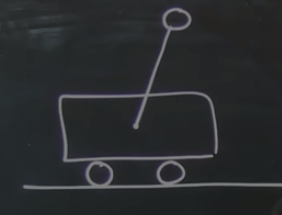

# Modelling Inverted Pendulum on a Cart

Move the cart around to stablise the pendulum. 

State of the system:

$x$: the position of the cart
$\theta$: the angle of the pendulum arm

$$s = \begin{bmatrix}x \\ \dot{x} \\ \theta \\ \dot{\theta}\end{bmatrix}$$
